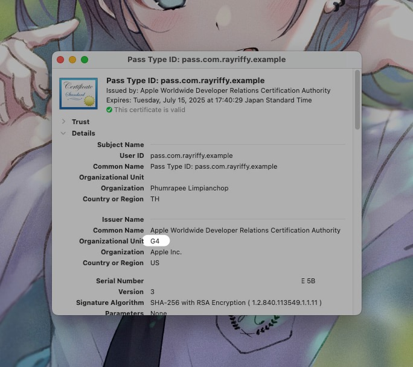

Garten Pass
===

An upcoming version of Creatorsgarten's ticketing method. Obtaining a ticket from eventpop, then you'll get a complementary event pass for your Apple Wallet app.

## Getting nessessary certificates

1. Locally on your macOS, create Certificate Signing Request (CSR) file.
2. At Apple Developer console, create **Pass Type ID** identifier.
3. Getting a production certificate, you should get `*.cer` file. Add it to Keychain Access.
4. Getting a root certificate of Apple Worldwide Developer Relations Certification Authority depends on which organization you're getting the certificate from locate on [Apple website](https://www.apple.com/certificateauthority/) and add it to your Keychain Access. 
5. Export as a key by following [this guide](https://github.com/alexandercerutti/passkit-generator/wiki/Generating-Certificates#generate-certificates-through-macos)

## Generating a pass

1. Modify function `createPass`, then run `pnpm tsx ./src/main.ts` command
2. AirDrop `dist/out.pkpass` to iPhone
3. Additionally, unzip `dist/out.zip` to observe `pass.json`, and `manifest.json` files.
